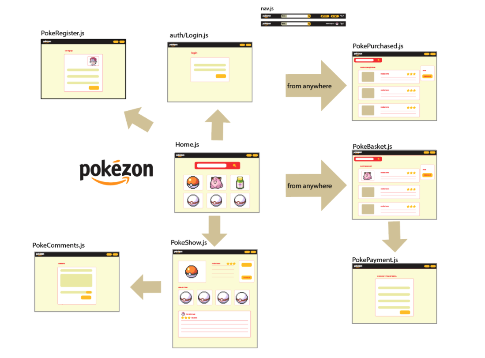
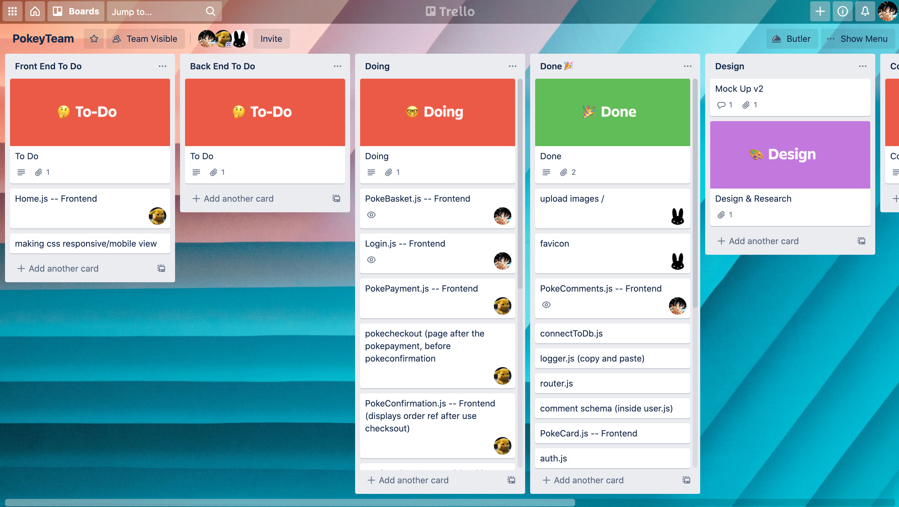
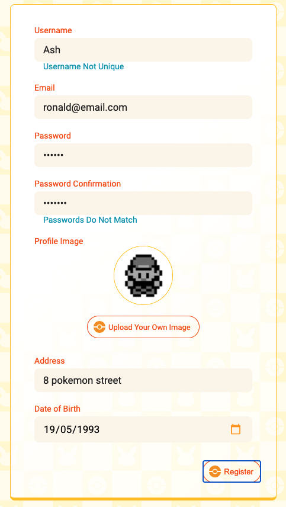
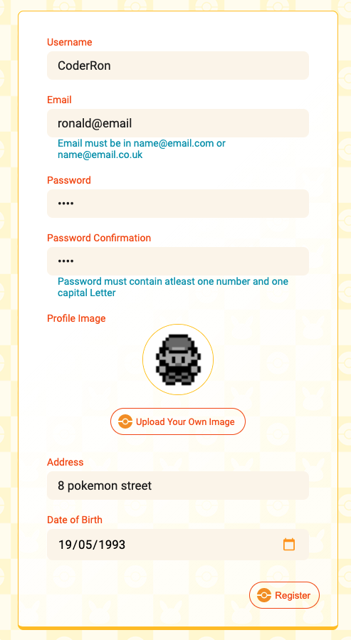
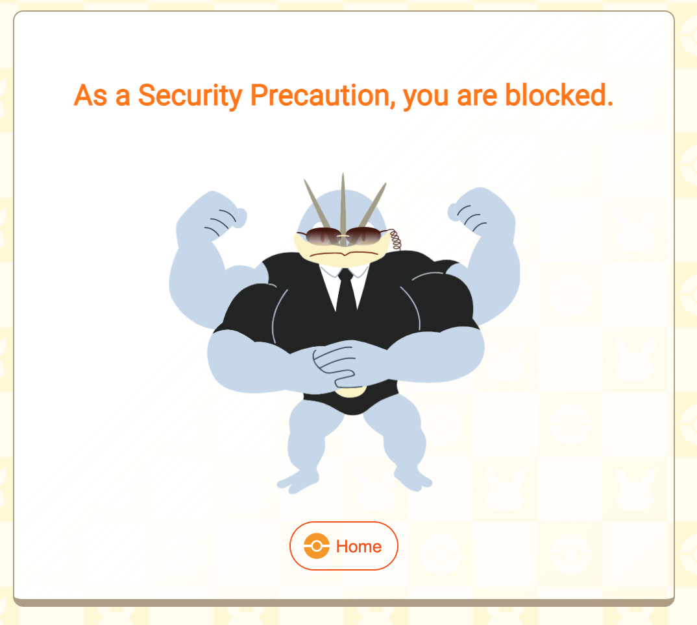
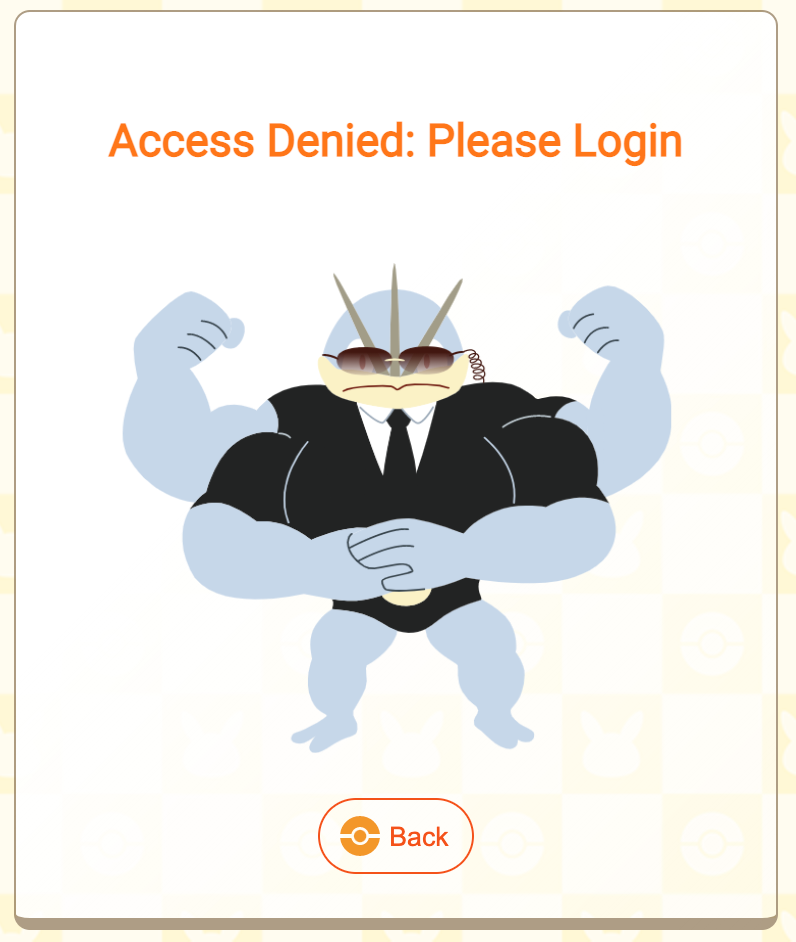
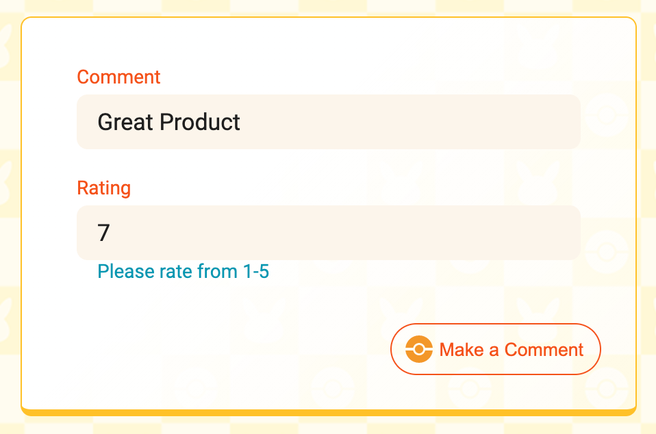
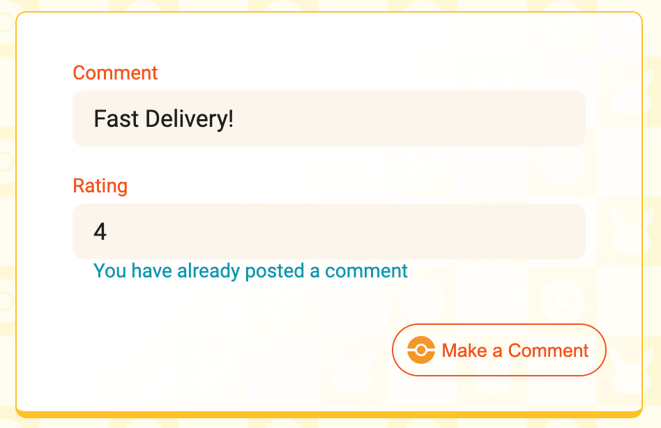

# Project 3: Pokezon

## Index

* [Overview](#overview)
* [Brief](#brief)
* [Technologies](#technologies)
* [Plan](#plan)
* [Registering a Customer](#registering-a-customer)
* [Logging In](#login)
* [Comments](#comments)
* [Basket](#Basket)
* [Addressing Security](#security)
* [Conclusion](#conclusion)

## Overview

For the third project at General Assembly, we were given just under 10 days, in a group of three, to create a fullstack web application. The software engineering course was taken remotely, so we communicated through Trello, Zoom, Slack and GitHub. 

The idea of Pokezon was essentially a merge between pokemon, a common interest we shared, and Amazon, a well-known shopping, ecommerce website. We essentially created Amazon that was Pokemon themed. Most of the assets, shopping items and data came from the original games.

## Brief 

To build a full-stack application, making out own back end and front end.
To use an Express API to serve data from a Mongo database.
To build the frontend using React to consume the API.
The API should have multiple relationships and CRUD functionality for at least a couple of models.

## Technologies

- HTML5
- CSS3 with animation
- JavaScript (ES6)
- React
- MongoDB
- Express
- Insomnia
- Heroku
- Trello
- Git
- GitHub
- Cloudinary
- Google Chrome dev tools
- Google Sheets
- VS Code
- Eslint
- Photoshop
- Illustrator

## Plan  

Before we coded it was very important that we planned exactly how we would approach the aim of building an ecommerce, shopping website. To set out the plan, we decided to organise everything using trello, and decided via zoom what components each team member would work on based on preference, experience and skill. 

My main role in this project was to focus purely on the functionalities mentioned in this readme. These functionaliites required both back-end and front-end programming. 


<p float="left" align="center">
  
   
</p>

## Registering a Customer

The User Model

```const userSchema = new mongoose.Schema({
  username: { type: String, required: true, unique: true, maxlength: 40 },
  email: { type: String, required: true, unique: true },
  password: { type: String, required: true },
  image: { type: String, required: true },
  address: { type: String, required: true }, 
  dob: { type: String, required: true },
  basket: [basketItem],
  total: {type: Number, default: 0},
  recentPurchases: [pastItem]
})
```


To register a user, I initially came up with the basic model of username, email, password, and password confirmation. As a team, we then later added more fields to the model. 

In the backend, the controller for registering a user in the back end is a basic one. 

```
async function registerUser(req, res, next) {
  try {
    const newUser = await User.create(req.body)
    return res.status(201).json({ message: `Welcome ${newUser.username}` })
  } catch (err) {
    next(err)
  }
}
```

```
    const [formdata, setFormdata] = React.useState({
    username: '',
    email: '',
    password: '',
    passwordConfirmation: '',
    image: 'https://res.cloudinary.com/dcwxp0m8g/image/upload/v1610368867/pokezon/default_user_image.png',
    address: '',
    dob: ''
  })

```

New users would have to provide all the information necessary in the object form in the front end to create a new user.  Successful users will be navigated to the login page. Whereas, unsuccessful users would receive the appropriate error responses from the backend to the front-end: users can be unsuccessful if they do not provide the correct information or if the information is not in the correct format.

<p float="left" align="center">
  
   
</p>

Usernames and emails have to be unique, and the password confirmation has to match the password. If not, the backend would prevent the registration of the customer, and the error messages will be given to the front-end as a response this then triggers the error messages of, for example, "Username not Unique", to the user.  

```
  //To check email
  if (formdata.email.slice(-4) !== '.com' && formdata.email.slice(-6) !== '.co.uk' && formdata.email.slice(-6) !== '.co.jp') { 
      setEmailInIncorrectFormat(true)
      return 
    }

```

```
  //To check  a capital letter in password and a number in a password

    const passwordToCheck = formdata.password.split('')
    const check = passwordToCheck.find(item => {
      const num = ['0','1','2','3','4','5','6','7','8','9']
      if (num.indexOf(item) !== -1)
        return true
    })

    if (!check) {
      setPasswordHasNoSpecialCharacter(true)
      return
    }

    const checkCapitals = passwordToCheck.find(item => {
      const capitals = ['A','B','C','D','E','F','G','H','I','J','K','L','M','N','O','P','Q','R','S','T','U','V','W','X','Y','Z']
      if (capitals.indexOf(item) !== -1) 
        return true
    })

    if (!checkCapitals) {
      setPasswordHasNoSpecialCharacter(true)
      return
    }

```


Some error messages are also handled in the front-end before the object form is sent to the backend: all passwords must contain at least one capital letter, and one number. Secondly, all emails must be in this format `email@domain.com` or `email@domain.co.uk`. 

## Login


The controller requires both the email and the password that was used to create the account. The controller checks to find a user which has an email the matches the one provided. It also checks to see if the password provided matches the password in the database. Failure to match both, throws an error of ‘unauthorised’ to the front-end to handle. If the given email and passwords are successful, the user is given a token, a token of which is needed to access areas of the website that are specific to the user.

```
async function loginUser(req, res, next) {
  try {
    const userToLogin = await User.findOne({ email: req.body.email })
    if (!userToLogin || !userToLogin.validatePassword(req.body.password)) {
      throw new Error(unauthorized)
    }
    const token = jwt.sign({ sub: userToLogin._id }, secret, { expiresIn: '7 days' })
    return res.status(202).json({ message: `Welcome back ${userToLogin.username}`, token })
  } catch (err) {
    next(err)
  }
}
```

```
function setToken(token) {
    window.localStorage.setItem('token', token)
  }

```

In the front-end, the email and password are sent using forms. Users who successfully receive the token from the backend have the token saved in the window’s local storage. Unsuccessful users, in response to the ‘unauthorized’ response from the back-end, are given 2 attempts to sign in successfully. Failure to do, prevents them from logging in, and they are redirected to the Home page. 

<p align="center" >
  
</p>

## Comments

We wanted customers to have the ability to comment on items they have purchased. In order to do this, I created a backend controller, and attached a relationship with the items model: This can be defined as a one to many relationship: items can have many comments. 

The Comment Model

```
export const commentSchema = new mongoose.Schema({
  text: { type: String, required: true, maxlength: 300 },
  rating: { type: Number, required: true, min: 1, max: 5 },

  owner: { type: mongoose.Schema.ObjectId, ref: 'User', required: true  },
}, {
  timestamps: true,
})


const itemSchema = new mongoose.Schema({
  name: { type: String, required: true, unique: true },
  stock: { type: Number, required: true },
  description: { type: String, required: true, maxlength: 400 },
  price: { type: Number, required: true },
  category: { type: String, required: true },
  image: { type: String, required: true },
  comments: [commentSchema],
})  

```

The comment schema attached to the item scheme has three fields: text, rating, and owner, the person who made the comment. 

<ins>Creating Comments</ins>

The general rules I wanted to follow here with comments are, customers can create comments, but cannot delete comments. Ratings have to be made from 1 - 5, and the owner refers to a user id that has to exist in the user database. All fields are required, the timestamp field being one which is created automatically. 

```
const [formdata, setFormdata] = React.useState({
    text: '',
    rating: ''
  })
```

```
  const handleSubmit = async e => {
    e.preventDefault()
    try {
      const response = await createComment(formdata)
      console.log('the response', response)
      history.push(`/pokeshow/${id}`)
    } catch (err) {

      if (err.response.data.message === 'You have already commented') {
        setAlreadyCommented(true)
      }

      if (err.response.data.errors) {
        console.log('Rating way too high')
        setRatingTooHigh(true)
      }
    }
  }
```

To make a comment requires three fields. Each comment requires text, rating and the owner – the person who made the comment. 

From the frontend, the request body requires the specific item id the user wants to comment on, the text and the rating. The last two were taken from the request body; whereas, the item id was taken from the url using req.params. Initially the controller checks to see if the item id exists, if not an error of not found will be thrown. 

```
async function itemCommentCreate(req, res, next) {
  const { id } = req.params
  const userId = req.currentUser._id
  
  try {
    const item = await Item.findById(id)
    if (!item) throw new Error('notFound') 

    const onlyCommentOwnerId = item.comments.map(comment => {
      return comment.owner._id
    })

    const findComment = onlyCommentOwnerId.find(specificId => {
      if (`${specificId}` === `${userId}`) {
        return true
      } else {
        return false
      }
    })

    if (findComment) {
      // return res.status(501).json({ message: 'You already commented'})
      throw new Error ('You have already commented')
    } 
    
    const newComment = { ...req.body, owner: req.currentUser._id }
    item.comments.push(newComment)
    await item.save()
    return res.status(201).json(item) 

  } catch (err) {
    next(err)
  }
}

```


The back-end plays a vital role in completing the function of creating a comment. The back-end controller only allow users to only comment once on each item, this prevents customers from spamming: If they already purchased an item, there is no need to make multiple comments of the same item.

The one comment system is achieved by this logic: each pre-existing comment on the item requested to comment on is mapped to return all the comment owner’s id, each owner’s id is then checked to see if the current user id that is logged in matches any of the mapped owner’s id, if so, an error will be thrown to the front-end preventing the comment from being created. 

However, if the current user has not created a comment on an item, the user otherwise, succesfully has his/her comment created from the request body (the object form) that is sent to the backend. The requests body will include both the item and text. Just before the comment is created, a further key is also added on to the owner field, the user id of the current user, this completes the creation of the comment and the item is saved and updated in the database, after a comment is created a unique id for that comment is created, the comment id. The user is then re-directed to the specific item page they viewed, and they are able to see the comment they just created.

<ins>Comment Error Handling</ins>

As mentioned above, users cannot make comments if they are not signed in, if they fail to rate from 1 - 5, or if they already commented. All of these are checked from the back-end controller, which sends the responses to the front-end to handle. The images below, styled and created by a team member, will be diplayed accordingly: 

<p align="center">
  
</p>

<p  float="left" align="center">
  
  
</p>

<ins>Deleting Comments</ins>

```
  const handleChangeDelete = async event => { //Delete Comments Logic 
    const commentId = event.target.value 
    try {
      await deleteComment(id, commentId)
      setCommentToDelete(event.target.value) 
    } catch (err) {
      console.log(err.response)
      if (err.response.data.message === 'Unauthorized') {
        setUnauthorized(true)
        return 
      }
    }
  }

```

To delete a comment, from the front-end, both the item id and the comment id, taken from the comment that was created, are needed. From the front-end, the item id is taken from the url using req.params, and the comment id is taken from the data that was requested on the page.

```
async function itemCommentDelete(req, res, next) {
  const { id, commentId } = req.params
  try {
    const item = await Item.findById(id)
    if (!item) throw new Error('notFound')
    const commentToDelete = item.comments.id(commentId)
    if (!commentToDelete) throw new Error('notFound')
    if (!commentToDelete.owner.equals(req.currentUser._id)) throw new Error('forbidden')
    await commentToDelete.remove()
    await item.save()
    return res.sendStatus(204)
  } catch (err) {
    next(err)
  }
}
```

At the back-end controller, the item id is checked to see if the item exists, the controller then checks to see if the comment id exists in the item object. I have then only allowed users who created their own comments to delete their own. Thus, if the owner of the comment does not match the current user that is logged in, an error of ‘forbidden’ will be thrown in the front-end to handle. If it is the owner, the comment would be deleted and the item will be updated with the comments accordingly.

<ins>Creating pre-existing comments</ins>


## Basket

<ins>Basket Model</ins>

```

const basketItem = new mongoose.Schema({
  quantity: {type: Number, default: 1}, 
  item: { type: mongoose.Schema.ObjectId, required: true, ref: 'Item' }
})

const userSchema = new mongoose.Schema({
  username: { type: String, required: true, unique: true, maxlength: 40 },
  email: { type: String, required: true, unique: true },
  password: { type: String, required: true },
  image: { type: String, required: true },
  address: { type: String, required: true }, 
  dob: { type: String, required: true },
  basket: [basketItem],
  total: {type: Number, default: 0},
  recentPurchases: [pastItem]
  //add time stamps
})

```

The basket is attached to the userSchema model, but is referenced to the basket item schema in order to form the relationship. There are two fields in the basketItem model, quantity, the default being 1, and item, this is in reference to the “Item” model, the pokemon items. 

<ins>The Basket controllers</ins>

There were three main functionalities that I incorporated with the shopping basket functionality: adding items to the basket, updating the quantity baskets in the basket and removing items in the basket. 

In the backend, all three controllers were set up to check if the current customer logged in has an account. This makes sure that only customers can see their own baskets, and not others. It also makes sure that customers must have an account and need to be logged in to view their basket. The error image of, "Please Log In", will be displayed. 

<ins>Adding Items to the Basket</ins>

```
const basketItem = new mongoose.Schema({
  quantity: {type: Number, default: 1}, 
  item: { type: mongoose.Schema.ObjectId, required: true, ref: 'Item' }
})
```
```
async function addItemToBasket(req, res, next) {

  try {
    const user = await User.findById(req.currentUser._id)
    if (!user) throw new Error('notFound')
    user.basket.push(req.body)
    await user.save()
    return res.status(201).json(user)
  } catch(err) {
    next(err)
  }
}
```

To add items to the basket, the back-end controller requires both the quantity, and the specific item id. This item id is in reference to an item id in the item database/model. The quantity has a default of 1 if the user was to leave this field blank. If users provide an item id that exists, then the user would successfully add the item and the quantity to their basket. The record of the user will be now have the item in the user object, and will be saved in the database. For every item that is added to the basket, a uniqie id will be created. This unique id is needed for both updating the quantity of items and removement of items in the basket. 

<ins>Deleting Items from the basket</ins>

Deleting items in the user's basket is as essential feature for a shopping basket. I decided to implement this functionality on the separate, basket webpage. 

```
async function removeItemFromBasket(req, res, next){

  const { itemId } = req.params

  try {
    const user = await User.findById(req.currentUser._id)
    if (!user) throw new Error('notFound')
    const itemToRemove = user.basket.id(itemId)
    if (!itemToRemove) throw new Error ('Item not found')
    await itemToRemove.remove()
    await user.save()
    return res.sendStatus(204)
  } catch(err) {
    next(err)
  }

}

```

```
  const handleBasketItemDelete = async e => {
    console.log(e.target.dataset.item)
    const itemToDelete = e.target.dataset.item
    try {
      await axios.delete(`/api/userprofile/basket/${itemToDelete}`, headers())
      const { data } = await axios.get('/api/userprofile', headers())
      console.log(data)
      
      if (data) e.target.parentNode.parentNode.parentNode.classList.add('slide_away')
      setTimeout(()=>{
        setUser(data)
      },700)

    } catch (err) {
      console.log('delete response failed', err)
    }
  }

```

The controller for removing items from the basket requires the unique id. The controller looks inside the current user’s basket and finds the unique id that matches the unique item id that was sent from the front-end. If unsuccessful an error of “Item not found” would be provided as a response. If successful, then the item is successfully removed, and the user record is saved and updated in the database.  

<ins>Updating Items in the basket</ins>

```
  const updateBasket = async e => {
    const itemIdToUpdate = e.target.dataset.item
   
    const body = {
      quantity: itemQty
    }

    try {
      const response = await axios.put(`/api/userprofile/basket/update/${itemIdToUpdate}`, body, headers())
      const { data } = await axios.get('/api/userprofile', headers())
      setUser(data)
      console.log(response)
    } catch (err) {
      console.log(err)
    }
  }

```

```
async function updateBasket(req, res, next) {
  const { itemId } = req.params
  
  try {
    const user = await User.findById(req.currentUser._id)
    if (!user) throw new Error('notFound')
    const itemToUpdate = user.basket.id(itemId)
    if (!itemToUpdate) throw new Error ('Item not found')
    itemToUpdate.quantity = req.body.quantity
    await user.save()
    return res.status(201).json(user)
  } catch (err) {
    console.log(err)
    next(err)
  }
}
```

I wanted customers to have the ability to update the quantities of the items in their basket on the basket webpage. Therefore, similar to the previous controller, the controllers looks inside the current’s user’s basket and finds the unique id that matches the unique item id sent from the front-end. If the match is successful, the controller selects the item, and updates the quantity key-value with the new quantity that is provided from the request body. The user object is then saved and updated in the database. In conjunction with this, the backend sends the updated user the latest version of the basket as a response. 

<ins>Checkout</ins>

## Security

## Conclusion

<ins>Wins and Challenges</ins>

Up to this point of the course, this project was the most enjoyable. There were definitely a number of wins working on this project. I was comfortable using git as a team to manage the project: every monring we all git merged and pulled, so that all members had the most latest version of the project. I was able to work in a well-organised, functional team: we held meetings every morning, outlining all the tasks we did the previous day, and the tasks we set out to do on the present day. I was able to code most of the functionalities of the e-commerce website. I believe we worked very well in a team: we were organised, and discussed any issues we were facing collectively as a team. 

<ins>Challenges</ins>

Although there were many wins with the project, in hindsight the biggest challenge would have to be finishing off the ambitious plan we set out to begin with. Although most of the functionalities of an eccomerce, shopping website were complete, we ran out a time with a few minor functionalities we wanted to implement. 


